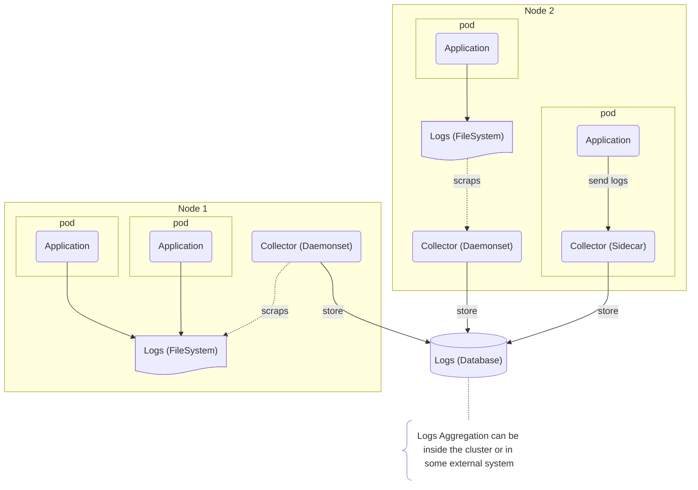
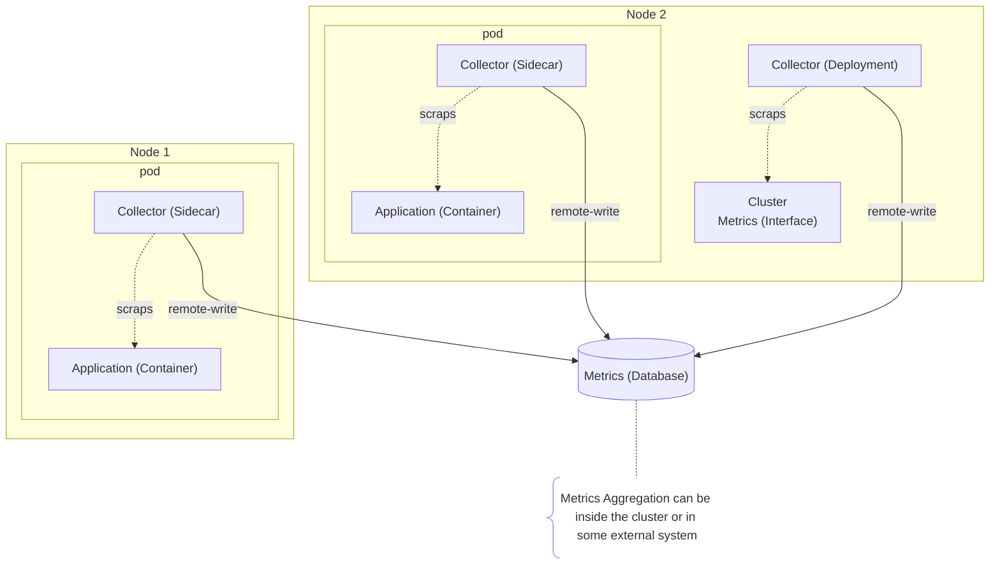
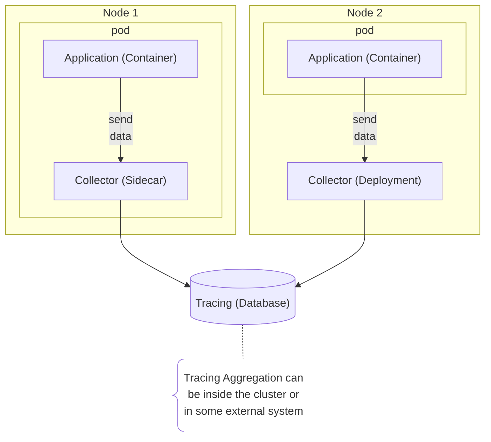

# OTEL Collectors

Open Telemetry collectors are the agents that collect the telemetry data (logs, metrics and tracing) from your applications and send it to some of the telemetry backends.

You can use 4 different types of deployment modes:

- **DaemonSet**: One collector per node. It's useful when you need to collect information from each node, like logs or some machine metrics.
- **Deployment**: You can control the number of collectors running. It's useful when you need only one collector in the entire cluster (for metrics, for example) or when you need to scale the number of collectors based on the load.
- **StatefulSet**: When you need predictable names for your collectors, like when you need to configure some specific rules in your network or when you need to use some specific storage. Kubernetes will attempt to keep the same collector running, even if the pod is rescheduled.
- **Sidecar**: When you need to collect telemetry from your application, you can use the sidecar mode. The collector will run in the same pod as your application. It's useful when you need to collect logs or traces from your application as fast and reliable as possible.

Let's show some simple diagrams of possible implementations of the collectors for each type of telemetry data:

---

---

---

Some [components of the default collector](https://opentelemetry.io/docs/kubernetes/collector/components/) or from the [contrib distribution](https://github.com/open-telemetry/opentelemetry-collector-contrib), runs best in a specific mode, like the **[Prometheus Receiver](https://github.com/open-telemetry/opentelemetry-collector-contrib/tree/main/receiver/prometheusreceiver)** that runs best in a **Deployment** mode.

There are 3 types of data that OpenTelemetry can collect: **Metrics**, **Logs** and **Tracing**.

- **Metrics**: Time-series data that can be used to monitor your applications and infrastructure.
- **Logs**: Structured data that can be used to debug your applications and infrastructure.
- **Tracing**: Data that can be used to understand the flow of your applications and infrastructure.

About the backend, we can use a lot of different components, like:

|    Type |                        Component                        | Description                                                       |
| ------: | :-----------------------------------------------------: | ----------------------------------------------------------------- |
| Metrics |        **[Prometheus](https://prometheus.io/)**         | Time-series database that can be used to store and query metrics. |
| Metrics |       **[Mimir](https://grafana.com/oss/mimir/)**       | Metrics aggregation system inspired by Prometheus.                |
| Metrics |              **[M3DB](https://m3db.io/)**               | M3 is a metrics platform that can store and query metrics.        |
|    Logs |        **[Loki](https://grafana.com/oss/loki/)**        | Loki is a horizontally-scalable log aggregation system            |
|    Logs |           **[Graylog](https://graylog.org/)**           | Graylog is a log management system.                               |
|    Logs |         **[S3](https://aws.amazon.com/pt/s3/)**         | S3 is a object storage system that can store logs.                |
|    Logs | **[CloudWatch](https://aws.amazon.com/pt/cloudwatch/)** | CloudWatch is a log management system.                            |
| Tracing |            **[Zipkin](https://zipkin.io/)**             | Zipkin is a distributed tracing system.                           |
| Tracing |       **[Jaeger](https://www.jaegertracing.io/)**       | Jaeger is a distributed tracing system.                           |
| Tracing |       **[Tempo](https://grafana.com/oss/tempo/)**       | Tempo is a distributed tracing system.                            |
| Tracing |    **[AWS X-Ray](https://aws.amazon.com/pt/xray/)**     | AWS X-Ray is a distributed tracing system.                        |
|     All |            **[SigNoz](https://signoz.io/)**             | SigNoz is an open-source APM and Observability tool.              |

There is some more complex environments that you can use, including specific documentation, like:

- **[Grafana Cloud](https://grafana.com/products/cloud/)**
- **[New Relic](https://newrelic.com/)**
- **[Datadog](https://www.datadoghq.com/)**
- **[Azure Monitor](https://azure.microsoft.com/pt-br/services/monitor/)**.
- **[Google Cloud Monitoring](https://cloud.google.com/monitoring)**
- **[Dynatrace](https://www.dynatrace.com/)**
- **[AppDynamics](https://www.appdynamics.com/)**
- **[Splunk](https://www.splunk.com/)**
- **[Sumo Logic](https://www.sumologic.com/)**
- **[Groundcover](https://www.groundcover.com/)** <- Very promising

## Daemonset

We will use DaemonSet to collect the some metrics and logs from the nodes.

| Component                                                                                                                             | Type      | Mode      | logs  | metrics | traces | Description                                     |
| ------------------------------------------------------------------------------------------------------------------------------------- | --------- | --------- | :---: | :-----: | :----: | ----------------------------------------------- |
| [Kubernetes Attributes](https://github.com/open-telemetry/opentelemetry-collector-contrib/tree/main/processor/k8sattributesprocessor) | Processor | DaemonSet |   ☑️   |    ☑️    |   ☑️    | Add Kubernetes attributes to the telemetry data |
| [Kubeletstats](https://github.com/open-telemetry/opentelemetry-collector-contrib/tree/main/receiver/kubeletstatsreceiver)             | Receiver  | DaemonSet |   ✖️   |    ☑️    |   ✖️    | Collect metrics from the kubelet                |
| [Filelog](https://github.com/open-telemetry/opentelemetry-collector-contrib/tree/main/receiver/filelogreceiver)                       | Receiver  | DaemonSet |   ☑️   |    ✖️    |   ✖️    | Collect logs from the filesystem                |
| [Host Metrics](https://github.com/open-telemetry/opentelemetry-collector-contrib/tree/main/receiver/hostmetricsreceiver)              | Receiver  | DaemonSet |   ❗   |    ☑️    |   ✖️    | Collect metrics from the host                   |
| [OTLP GRPC](https://github.com/open-telemetry/opentelemetry-collector/tree/main/exporter/otlpexporter)                                | Exporter  | DaemonSet |   ☑️   |    ✅    |   ✅    | Export telemetry data to the OTLP format        |
| [OTLP HTTP](https://github.com/open-telemetry/opentelemetry-collector/tree/main/exporter/otlphttpexporter)                            | Exporter  | DaemonSet |   ☑️   |    ✅    |   ✅    | Export telemetry data to the OTLP format        |

> ✅ stable | 🩴 alpha | ☑️ beta | ❗ dev | ✖️ not available

## Deployment (Only 1 replica)

| Component                                                                                                                             | Type      | Mode       | logs  | metrics | traces | Description                                             |
| ------------------------------------------------------------------------------------------------------------------------------------- | --------- | ---------- | :---: | :-----: | :----: | ------------------------------------------------------- |
| [Kubernetes Attributes](https://github.com/open-telemetry/opentelemetry-collector-contrib/tree/main/processor/k8sattributesprocessor) | Processor | Deployment |   ☑️   |    ☑️    |   ☑️    | Add Kubernetes attributes to the telemetry data         |
| [Kubernetes Cluster](https://github.com/open-telemetry/opentelemetry-collector-contrib/tree/main/receiver/k8sclusterreceiver)         | Receiver  | Deployment |   ❗   |    ☑️    |   ✖️    | Collect metrics from the kubernetes cluster             |
| [Kubernetes Objects](https://github.com/open-telemetry/opentelemetry-collector-contrib/tree/main/receiver/k8sobjectsreceiver)         | Receiver  | Deployment |   ☑️   |    ✖️    |   ✖️    | Add Kubernetes objects attributes to the telemetry data |
| [Prometheus](https://github.com/open-telemetry/opentelemetry-collector-contrib/tree/main/receiver/prometheusreceiver)                 | Receiver  | Deployment |   ✖️   |    ☑️    |   ✖️    | Collect metrics from the Prometheus format              |
| [OTLP GRPC](https://github.com/open-telemetry/opentelemetry-collector/tree/main/exporter/otlpexporter)                                | Exporter  | Deployment |   ☑️   |    ✅    |   ✅    | Export telemetry data to the OTLP format                |
| [OTLP HTTP](https://github.com/open-telemetry/opentelemetry-collector/tree/main/exporter/otlphttpexporter)                            | Exporter  | Deployment |   ☑️   |    ✅    |   ✅    | Export telemetry data to the OTLP format                |

> ✅ stable | 🩴 alpha | ☑️ beta | ❗ dev | ✖️ not available

## Sidecar

| Component                                                                                                  | Type     | Mode    | logs  | metrics | traces | Description                                 |
| ---------------------------------------------------------------------------------------------------------- | -------- | ------- | :---: | :-----: | :----: | ------------------------------------------- |
| [OTLP](https://github.com/open-telemetry/opentelemetry-collector/tree/main/receiver/otlpreceiver)          | Receiver | Sidecar |   ☑️   |    ✅    |   ✅    | Receive telemetry data from the application |
| [OTLP GRPC](https://github.com/open-telemetry/opentelemetry-collector/tree/main/exporter/otlpexporter)     | Exporter | Sidecar |   ☑️   |    ✅    |   ✅    | Export telemetry data to the OTLP format    |
| [OTLP HTTP](https://github.com/open-telemetry/opentelemetry-collector/tree/main/exporter/otlphttpexporter) | Exporter | Sidecar |   ☑️   |    ✅    |   ✅    | Export telemetry data to the OTLP format    |

> ✅ stable | 🩴 alpha | ☑️ beta | ❗ dev | ✖️ not available

There is some common exporters depending on the backend that you choose. Most of the backends have an exporter to the OTLP format, but some of them have a specific exporter. Let's show some of them:

| Component                                                                                                                   | Type     | logs  | metrics | traces | Description |
| --------------------------------------------------------------------------------------------------------------------------- | -------- | :---: | :-----: | :----: | ----------- |
| [Zipkin](https://github.com/open-telemetry/opentelemetry-collector-contrib/tree/main/exporter/zipkinexporter)               | Exporter |   ✖️   |    ✖️    |   ☑️    |             |
| [S3](https://github.com/open-telemetry/opentelemetry-collector-contrib/tree/main/exporter/awss3exporter)                    | Exporter |   🩴   |    🩴    |   🩴    |             |
| [AWS X-Ray](https://github.com/open-telemetry/opentelemetry-collector-contrib/tree/main/exporter/awsxrayexporter)           | Exporter |   ✖️   |    ✖️    |   ☑️    |             |
| [ElasticSearch](https://github.com/open-telemetry/opentelemetry-collector-contrib/tree/main/exporter/elasticsearchexporter) | Exporter |   ☑️   |    ❗    |   ☑️    |             |
| [RabbitMQ](https://github.com/open-telemetry/opentelemetry-collector-contrib/tree/main/exporter/rabbitmqexporter)           | Exporter |   🩴   |    🩴    |   🩴    |             |
